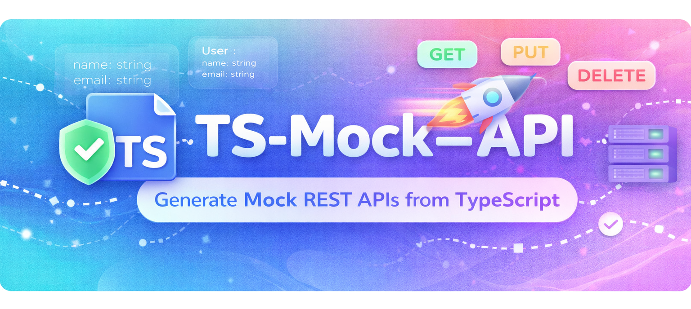

<p align="center" height="200">

[](https://gitcgr.com/Many0nne/TS-Mock-API)
  
</p>

<h1 align="center">TS-Mock-Proxy</h1>

<p align="center">
  Instant REST API from TypeScript interfaces — no backend required.
</p>

<p align="center">
  <a href="#-quick-start">Quick Start</a> ·
  <a href="#-reference">Reference</a> ·
  <a href="#-license">License</a>
</p>

---

Write a TypeScript interface, get a fully working REST API with realistic mock data, pagination, filtering, Swagger docs, and persistence. Ideal for frontend teams working independently of the backend.

---

## ⚡ Quick Start

### 1 — Install

```bash
npm install -g ts-mock-proxy
# or use directly with npx (no install needed)
```

### 2 — Define your types

Mark any interface with `// @endpoint` to expose it as an API route:

```typescript
// types/user.ts
// @endpoint
export interface User {
  id: number;
  name: string;
  email: string;
  role: 'admin' | 'user';
}
```

### 3 — Start the server

```bash
# Interactive wizard (recommended for first run)
npx ts-mock-proxy

# Or directly via CLI
npx ts-mock-proxy --types-dir ./types --port 3000
```

### 4 — Call your API

```bash
GET  /users          # → paginated list of User
GET  /users/1        # → single User
POST /users          # → create (body echoed back)
PUT  /users/1        # → replace
PATCH /users/1       # → partial update
DELETE /users/1      # → delete
```

> URL prefixes `api` and `v{n}` are stripped automatically — `/api/v1/users/1` works the same as `/users/1`.

### 5 — Explore in Swagger

```
http://localhost:8080/api-docs
```

All endpoints are documented and testable directly from the browser.

---

## 📖 Reference

- [CLI Options](#cli-options)
- [URL Patterns](#url-patterns)
- [Pagination, Filtering & Sorting](#pagination-filtering--sorting)
- [JSDoc Field Constraints](#jsdoc-field-constraints)
- [Mock Modes](#mock-modes)
- [JSON Persistence](#json-persistence)
- [How It Works](#how-it-works)

---

### CLI Options

```
Options:
  -t, --types-dir <path>        Directory with TypeScript types (required)
  -p, --port <number>           Server port (default: 8080)
  -l, --latency <range>         Latency simulation "min-max" (e.g., 500-2000)
  --mock-mode <strict|dev>      Mock mode (default: dev)
  --persist-data [path]         Persist mock data to JSON file (default: .mock-data.json)
  --no-hot-reload               Disable auto-reload on changes
  --no-cache                    Disable schema caching
  -v, --verbose                 Enable verbose logging
  -h, --help                    Show help
```

**Environment variables**

| Variable | Values | Description |
|---|---|---|
| `MOCK_API_MODE` | `strict`, `dev` | Override mock mode without a CLI flag |

Resolution order: CLI `--mock-mode` > `MOCK_API_MODE` env var > config file > default (`dev`).

---

### URL Patterns

The server only accepts idiomatic REST URLs. Each path segment is classified as a **collection name** (plural noun) or an **ID** (numeric, UUID, or MongoDB ObjectId).

| URL | Response |
|---|---|
| `GET /users` | Paginated array of `User` |
| `GET /users/123` | Single `User` |
| `GET /users/550e8400-…` | Single `User` (UUID) |
| `GET /users/123/posts` | Paginated array of `Post` |
| `GET /user` | **404** — singular names are rejected |
| `GET /users/123/posts/456` | **404** — nested single items are not supported |

---

### Pagination, Filtering & Sorting

All collection endpoints (`GET /resources`) support these query parameters. Responses always use the envelope format:

```json
{
  "data": [...],
  "meta": { "total": 100, "page": 2, "pageSize": 20, "totalPages": 5 }
}
```

The server maintains an in-memory pool of 100 mock items per type — filters, sort, and pagination operate on that pool, so `total` reflects a realistic number.

#### Pagination

| Param | Default | Max | Description |
|---|---|---|---|
| `page` | `1` | — | Page number (1-based) |
| `pageSize` | `20` | `100` | Items per page |

#### Filtering

| Convention | Type | Example | Description |
|---|---|---|---|
| `field=value` | string / number / boolean | `role=admin` | Exact match (case-insensitive for strings) |
| `field_contains=value` | string | `email_contains=@example.com` | Substring match |
| `field_gte=value` | number / date | `createdAt_gte=2024-01-01` | Greater than or equal |
| `field_lte=value` | number / date | `price_lte=100` | Less than or equal |

Multiple filters combine with AND logic. Unknown fields are ignored. Dates must be ISO 8601.

#### Sorting

```bash
GET /users?sort=createdAt:desc,name:asc
```

Sorting by a field that doesn't exist in the interface returns `400`.

#### Error responses

```json
{ "error": "Invalid query parameters", "message": "\"pageSize\" must not exceed 100" }
{ "error": "Invalid sort parameter", "message": "Cannot sort by unknown field \"foo\". Allowed fields: email, id, name" }
```

---

### JSDoc Field Constraints

Add constraints to interface fields using JSDoc annotations. Generated mock data will always respect these rules.

| Annotation | Type | Example |
|---|---|---|
| `@min` / `@max` | number | `@min 1 @max 100` |
| `@minLength` / `@maxLength` | string | `@minLength 3 @maxLength 20` |
| `@pattern` | string | `@pattern ^[a-z]+$` |
| `@enum` | any | `@enum ACTIVE,INACTIVE,PENDING` |

```typescript
// @endpoint
export interface Product {
  /** @maxLength 50 */
  title: string;

  /** @min 0.01 @max 999999.99 */
  price: number;

  /** @enum DRAFT,PUBLISHED,ARCHIVED */
  status: string;

  /** @minLength 10 @maxLength 500 */
  description: string;
}
```

Generated response:
```json
{ "title": "Wireless Headphones", "price": 49.99, "status": "PUBLISHED", "description": "A detailed product description..." }
```

> Constraints are applied during generation, not enforced at validation time. Mock data is always returned — never rejected.

---

### Mock Modes

| Mode | Description |
|---|---|
| `dev` (default) | Full mock features: `x-mock-status` header, artificial latency |
| `strict` | Clean REST simulation — mock features disabled, behaves like a real API |

```bash
npx ts-mock-proxy --types-dir ./types --mock-mode strict
# or
MOCK_API_MODE=strict npx ts-mock-proxy --types-dir ./types
```

#### Dev-mode features

**Force a response status** with the `x-mock-status` header:

```bash
curl -H "x-mock-status: 503" http://localhost:8080/users
# → 503 response, regardless of the route
```

**Simulate network latency** via `--latency min-max` (milliseconds):

```bash
npx ts-mock-proxy --types-dir ./types --latency 200-800
```

In `strict` mode these features are never mounted — not just disabled, they don't exist in the request pipeline.

---

### JSON Persistence

By default mock data is in-memory and resets on restart. Enable persistence to keep data between sessions.

#### Enable

```bash
npx ts-mock-proxy --types-dir ./types --persist-data
# Uses default path: .mock-data.json

npx ts-mock-proxy --types-dir ./types --persist-data ./data/mocks.json
# Custom path
```

Via config file (`.mock-config.json`):
```json
{ "persistData": ".mock-data.json" }
```

Or through the interactive wizard (advanced options section).

#### File format

A flat JSON object keyed by TypeScript interface name:

```json
{
  "User": [
    { "id": 1, "name": "Alice", "email": "alice@example.com" },
    { "id": 2, "name": "Bob",   "email": "bob@example.com" }
  ],
  "Post": [
    { "id": 1, "title": "Hello World", "authorId": 1 }
  ]
}
```

You can edit this file manually while the server is stopped — changes are picked up on the next startup.

> **Warning:** if a mutation (POST/PUT/PATCH/DELETE) happens while the server is running, it will overwrite the file. Stop the server before editing manually.

#### Behaviour reference

| Situation | Result |
|---|---|
| First launch, no file | File created with generated data |
| Restart, file present | Pools loaded from file |
| New type added to `typesDir` | Generated and appended to file at startup |
| POST / PUT / PATCH / DELETE | File updated atomically after every mutation |
| `POST /mock-reset` | File overwritten with freshly generated data |
| `POST /mock-reset/User` | Only `User` regenerated and saved |
| `[]` in file | Preserved — not regenerated (intentional empty state) |
| Invalid JSON in file | Warning logged, server starts normally, file left untouched |
| Hot-reload (type file changed) | Affected types regenerated and saved; others untouched |

Writes are atomic: data goes to `.mock-data.json.tmp` first, then renamed, so an interrupted write never corrupts the existing file.

#### Selective rebuild

Regenerate a single type without touching the others:

```bash
POST /mock-reset/User
# → {"message": "Mock data regenerated for type \"User\"", "type": "User", "count": 10}
```

The Swagger UI also exposes a type selector dropdown → **Rebuild selected** next to the global **Rebuild Data** button.

---

### How It Works

1. **Type discovery** — the server scans `typesDir` recursively for `.ts` files. Only interfaces annotated with `// @endpoint` (or a JSDoc `@endpoint` block) are exposed.

2. **URL routing** — `api` and `v{n}` prefix segments are stripped. Remaining segments are classified as collection names (plural noun) or IDs (numeric / UUID / ObjectId). Anything that doesn't match a known pattern returns 404.

3. **Mock generation** — Intermock parses the TypeScript AST to understand your interface shape. Faker generates realistic field values. JSDoc constraint annotations (`@min`, `@max`, `@enum`, etc.) are applied post-generation to ensure conformance.

4. **Data pools** — each `@endpoint` type gets a pool of 100 mock items on first request. Filters, sorting, and pagination operate on this pool, so collection sizes feel realistic across pages.

5. **Write operations** — POST/PUT/PATCH/DELETE mutate an in-memory write store on top of the pool. The merged view (write store + pool − deleted IDs) is what GET collection endpoints return.

---

## 📄 License

MIT
